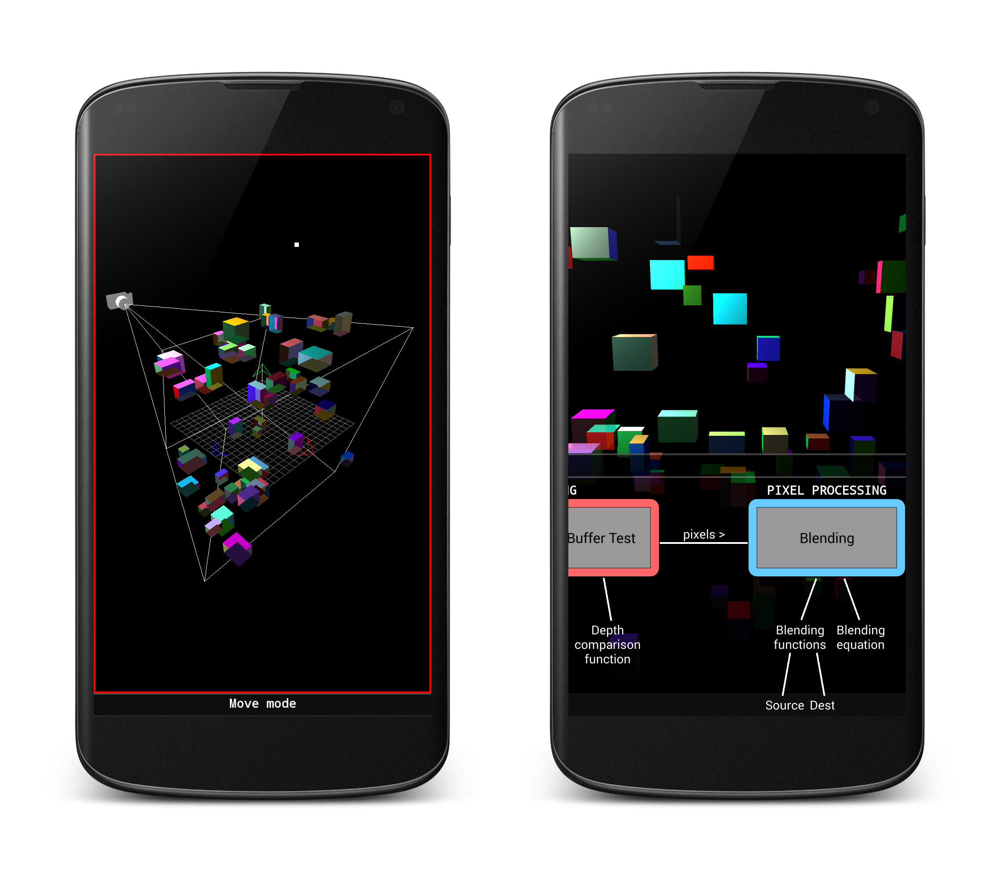

# Mobile Graphics Pipeline Simulator

This project is an interactive simulation of the graphics pipeline. It is intended as an educational tool to allow students to visualise the effect of each pipeline step as it is applied to arbitrary scenes. The application is a 3rd year computer science project for the University of Oxford.

### Author
James Nicholls

### Licence
&copy; [University of Oxford](https://www.admin.ox.ac.uk/statutes/790-121.shtml), [James Nicholls](http://www.github.com/ryft)

The project has been made available for the duration of the assessment period, after which its visibility is dependent upon permission granted by the university.
